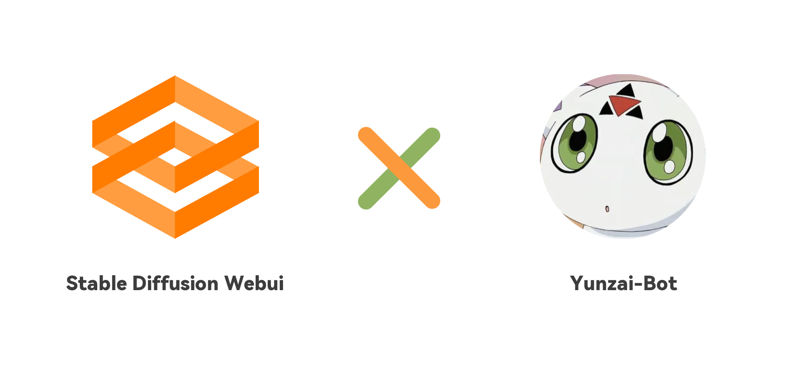
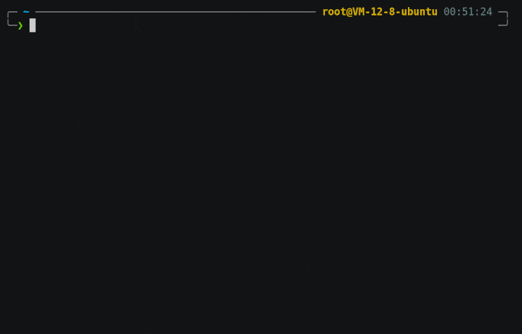

<!--
 * @Author: 渔火Arcadia  https://github.com/yhArcadia
 * @Date: 2022-12-22 00:38:21
 * @LastEditors: 渔火Arcadia
 * @LastEditTime: 2023-01-11 01:33:53
 * @FilePath: \Yunzai-Bot\plugins\ap-plugin\README.md
 * @Description: 版本：2.8.12
 *
 * Copyright (c) 2022 by 渔火Arcadia 1761869682@qq.com, All Rights Reserved.
-->

<p align="center">
  <a href="https://ap-plugin.com/"></a>
</p>

<div align="center">

# Ap-plugin

_🎉 基于Yunzai-Bot的AI绘图插件 🎉_

</div>

<p align="center">
  </a>
    
  </a>
</p>

****

<span id="header"></span>

<p align="center">
  
  
  <br>
  </a>
    
  </a>
    <a href="https://jq.qq.com/?_wv=1027&k=OtkECVdE">
    
  </a>
    <a href="https://jq.qq.com/?_wv=1027&k=FZUabhdf">
    
  </a>
</p>

<p align="center">
  <a href="https://gitee.com/yhArcadia/ap-plugin">项目地址</a>
  ·
  <a href="#安装插件">开始使用</a>
  ·
  <a href="#配置接口">配置接口</a>
</p>

## 简介

Ap-plugin是一款在QQ内快速调用[Stable Diffusion web UI](https://github.com/AUTOMATIC1111/stable-diffusion-webui)提供的API接口进行多参数便捷AI绘图的[Yunzai-Bot](https://github.com/Le-niao/Yunzai-Bot)插件，除此之外也拥有多种图片处理功能，本插件功能不断拓展中，更多功能敬请期待……


## 安装插件

<!-- ### 前置安装注意

本插件有较多复杂配置，如果没有以下技能，请停止对插件的安装。

* 可能需要义务教育要求的阅读理解水平
* 可能需要义务教育要求的语文理解水平
* 需要认识26个字母并学会如何翻译它们
* 能熟练地使用一种浏览器
* 有基础的代码辨识能力，比如什么是True，什么是False
* 对于Yunzai有一定的了解，有一定的错误排查能力

如果您在配置与使用中遇到问题，请先阅读[提问的智慧](https://github.com/ryanhanwu/How-To-Ask-Questions-The-Smart-Way/blob/main/README-zh_CN.md)后，加入我们的[交流群](#header)进行提问，一般来说聪明问题将会得到解答 -->

<p align="center">
  <a href="https://asciinema.org/a/550312">
    
  </a>
</p>

 1. 挂载至Yunzai-Bot目录
``` 
cd Yunzai-Bot
```

 2. 克隆本仓库至plugins目录
 - 使用Gitee（国内服务器推荐使用此方法）
```
git clone https://gitee.com/yhArcadia/ap-plugin.git ./plugins/ap-plugin
```

 - 使用Github
``` 
git clone https://github.com/yhArcadia/ap-plugin.git ./plugins/ap-plugin
```

 3. 安装必要依赖（axios）
 - 使用npm
```
npm install axios --registry=https://registry.npmmirror.com
```

 - 使用pnpm
```
pnpm add axios -w
```

 4. 重启Yunzai
```
npm restart
```

## 配置接口

|        需要配置的接口       |                         用途                         |                         配置文档                         |
| :-------------------------: | :--------------------------------------------------: | :------------------------------------------------------: |
|     Stable Diffusion接口    | 用于生产图片，相关功能：[绘图](#以文生图)，[以图生图](#以图生图)，[二次元的我](#二次元的我)等 | [文档链接](https://www.wolai.com/rMR9bFJehYhBKdQT6dY3zL) |
|        Real-CUGAN接口       |           用于图像超分，相关功能：[大清晰术](#大清晰术)           | [文档链接](https://www.wolai.com/22QBzD37qxaTcUKaB2zYRK) |
|       DeepDanbooru接口      |     用于逆推图片Tags，相关功能：[鉴赏](#鉴赏)，[二次元的我](#二次元的我)     | [文档链接](https://www.wolai.com/jRW3wLMn53vpf9wc9JCo6T) |
|     Anime Ai Detect接口     |    用于检测图像是否是AI制作的，相关功能：[鉴定图片](#鉴定图片)    | [文档链接](https://www.wolai.com/3koPDP8wEne97evw1bjDiL) |
| Anime Remove Background接口 |          用于去除图片背景，相关功能：[去背景](#去背景)          | [文档链接](https://www.wolai.com/sSZM1AHnBULxyc4s4hKquF) |
|White Box Cartoonization接口|    用于将图片转换成动漫风格，相关功能：[图片动漫化](#图片动漫化)    | [文档链接](https://www.wolai.com/ePdgFyjmMuUR9hfd4G2XLK) |
|       百度图片审核服务      |         用于检查图像是否合规，相关功能：[图像审核](#图像审核)         | [文档链接](https://www.wolai.com/9vacNhw3TPuCPy5pLYQnYw) |

其中，Stable Diffusion接口需要大量算力生成图像，相对来说成本较高，详情信息可查看[关于绘图接口的相关说明](https://www.wolai.com/k6qBiSdjzRmGZRk6cygNCk)；百度图片审核服务免费额度用完后是收费的，大约是5元10000次审核次数，总的来说还是比较便宜的；除这两个接口门槛较高外，其他的接口都是免费在[Hugging Face](https://huggingface.co/)上部署的，请自行斟酌，插件开发者不免费提供（也没能力提供）任何接口，不愿意动手的小伙伴劝退

## 功能演示

#### 帮助
> 首次使用请发送**ap帮助**查看可用指令

#### 以文生图

> 使用Stable Diffusion接口根据用户输入的prompt进行作图

<details>
<summary>展开/收起</summary>

可选参数：
 - 图片方向：竖图，横图，方图（默认竖图512×768，横图768×512，方图640×640）
 - 采样方法：采样器Euler a（指定采样器）
 - 采样迭代步数：步数60（值越高图像越精细）
 - 种子：种子468751975（用于生成相似图）
 - 提示词相关性：自由度11（越高越自♂由）
 - 指定接口：接口2（如果你有多接口，指定接口作图）
 - 批量绘制：5张（批量绘制图片）

|  指令 |  回复  |                      示例                      |
| :---: | :----: | :--------------------------------------------: |
| #绘图+${参数} | [图片]+${参数} |  |

</details>

#### 以图生图

> 使用Stable Diffusion接口根据用户输入的prompt与图片进行作图

<details>
<summary>展开/收起</summary>

可选参数：
 - 继承[以文生图](#以文生图)的所有参数
 - 重绘幅度：强度0.6（越高越接近prompt所描述）
 - [图片]：带上你的图片（附带图片，引用图片与艾特用户均可）

|  指令 |  回复  |                      示例                      |
| :---: | :----: | :--------------------------------------------: |
| #绘图+${参数}+[图片] | [图片]+${参数} |  |

</details>

#### 二次元的我

> 使用Stable Diffusion接口为用户生成各种属性的二次元人设，每天一种属性

<details>
<summary>展开/收起</summary>

可选参数：
 - 二次元的我（不带前缀：随机获取属性生成图片）
 - #二次元的我（带#号前缀：使用头像与随机获取的属性以图生图）
 - %二次元的我（带%号前缀：使用DeepDanbooru接口(若可用，不可用与#号前缀相同)对头像进行逆推Tags，结合随机属性生成图片）
 - /二次元的我（带/号前缀：使用DeepDanbooru接口(若可用，不可用与无前缀相同)对头像进行逆推Tags，生成图片）
 - (全局)刷新二次元的我：刷新获取到的属性

|  指令 |  回复  |                      示例                      |
| :---: | :----: | :--------------------------------------------: |
| ${前缀}二次元的我 | [图片]+${属性} |  |

</details>

#### 大清晰术

> 使用Real-CUGAN接口对图片进行超分与降噪

<details>
<summary>展开/收起</summary>

可选参数：
 - 超分：二重唱，三重唱，四重唱（对应2倍，3倍，4倍超分）
 - 降噪：强力术式，中等术式，不变式，原式（等级越高，降噪越强）

|  指令 |  回复  |                      示例                      |
| :---: | :----: | :--------------------------------------------: |
| #大清晰术+${参数}+[图片] | [图片]+${参数} |  |

</details>

#### 鉴赏

> 使用DeepDanbooru接口对图片进行逆推Tags

<details>
<summary>展开/收起</summary>

|  指令 |  回复  |                      示例                      |
| :---: | :----: | :--------------------------------------------: |
| #鉴赏+[图片] | [图片]+${结果} |  |

</details>

#### 鉴定图片

> 使用Anime Ai Detect接口对图像进行检查是否为AI制作

<details>
<summary>展开/收起</summary>

|  指令 |  回复  |                      示例                      |
| :---: | :----: | :--------------------------------------------: |
| #鉴定图片+[图片] | ${结果} |  |

**※：此功能为AI鉴定，结果并不一定精准，请理智辨别，造成任何纠纷与插件作者无关**

</details>

#### 去背景

> 使用Anime Remove Background接口对图像背景进行去除

<details>
<summary>展开/收起</summary>

|  指令 |  回复  |                      示例                      |
| :---: | :----: | :--------------------------------------------: |
| #去背景+[图片] | [图片] |  |

</details>

#### 图片动漫化

> 使用White Box Cartoonization接口对图片进行动漫化

<details>
<summary>展开/收起</summary>

|  指令 |  回复  |                      示例                      |
| :---: | :----: | :--------------------------------------------: |
| #图片动漫化+[图片] | [图片] |  |

</details>

#### 图像审核

> 使用百度图片审核服务进行图像审核，避免绘制违规图片导致机器人封禁

<details>
<summary>展开/收起</summary>

**※：在使用前请安装baidu-aip-sdk依赖**
```
pnpm add baidu-aip-sdk -w
```

|  指令 |  回复  |                      示例                      |
| :---: | :----: | :--------------------------------------------: |
| #ap设置审核开启 | 开启 |  |

</details>

#### 卢浮宫

> 使用Canvas画板将**赛璐珞风格**动画截图或**插画**，转换成**One Last Kiss**封面风格

<details>
<summary>展开/收起</summary>

**※：在使用前请安装canvas依赖，此依赖无法在旧版本系统安装（目前未解决该问题）**
```
cnpm install canvas --canvas_binary_host_mirror=https://registry.npmmirror.com/-/binary/canvas
```

可选参数：
 - 精细程度：精细，一般，稍粗，极粗，浮雕（五个只能选一个哦！）
 - 降噪：带上此参数则开启，否则关闭
 - 水印：加上「One Last Image」水印
 - 初回：加上「One Last Image」彩色水印（仅开启水印情况下有效）
 - Kiss：Kiss滤镜
 - 线迹轻重：80-126之间
 - 调子数量：20-200之间

|  指令 |  回复  |                      示例                      |
| :---: | :----: | :--------------------------------------------: |
| #卢浮宫+${参数}+[图片] | [图片] |  |

</details>

## Todo
- [ ] 更严谨的API鉴权方式（Arcadia）
- [ ] 简单图片处理（Su）
- [ ] 云端同步与共享预设（Su）
- [ ] 咕咕咕？

## 致谢
[AUTOMATIC1111/stable-diffusion-webui](https://github.com/AUTOMATIC1111/stable-diffusion-webui)：stable-diffusion-webui项目  
[秋葉aaaki](https://space.bilibili.com/12566101/)：电子佛祖，赛博菩萨  
[DianXian/Real-CUGAN](https://huggingface.co/spaces/DianXian/Real-CUGAN)：超级棒的Real-CUGAN在线接口  
[NoCrypt/DeepDanbooru_string](https://huggingface.co/spaces/NoCrypt/DeepDanbooru_string)：超级棒的DeepDanbooru在线接口  
[saltacc/anime-ai-detect](https://huggingface.co/spaces/saltacc/anime-ai-detect)：超级棒的鉴定图片项目  
[skytnt/anime-remove-background](https://huggingface.co/spaces/skytnt/anime-remove-background)：超级棒的去背景项目  
[hylee/White-box-Cartoonization](https://huggingface.co/spaces/hylee/White-box-Cartoonization)：超级棒的图片动漫化项目  
[itorr/one-last-image](https://github.com/itorr/one-last-image)：超级好看的卢浮宫生成器  

## 声明
此项目仅用于学习交流，请勿用于非法用途

### 爱发电

如果你喜欢这个项目，请不妨点个Star🌟，这是对开发者最大的动力  
当然，你可以对我爱发电赞助，呜咪~❤️

<details>
<summary>展开/收起</summary>

<p>
  </a>
    
  </a>
</p>

</details>

## 我们

<a href="https://github.com/yhArcadia/ap-plugin/graphs/contributors">
  
</a>